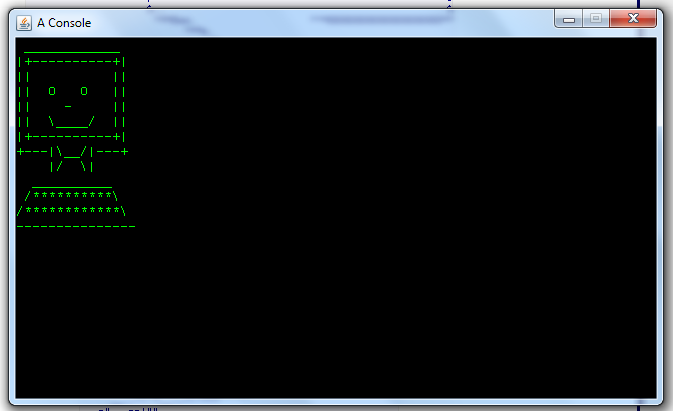

# DrawingThingy
A drawing thingy

Usage: 
- CTRL+S -> SAVE.
- CTRL+C -> CLEAR.
- DEL -> DELETE CURRENT CHARACTER.
- UP, DOWN, LEFT, RIGHT -> MOVE AROUND.
- SPACE -> KINDA LIKE MOVE AROUND.

 
[raw](https://raw.githubusercontent.com/dmitrymakhnin/DrawingThingy/master/kindacool.png)

 
[raw](https://raw.githubusercontent.com/dmitrymakhnin/DrawingThingy/master/meep.png)

  
[raw](https://raw.githubusercontent.com/dmitrymakhnin/DrawingThingy/master/eep.png)

